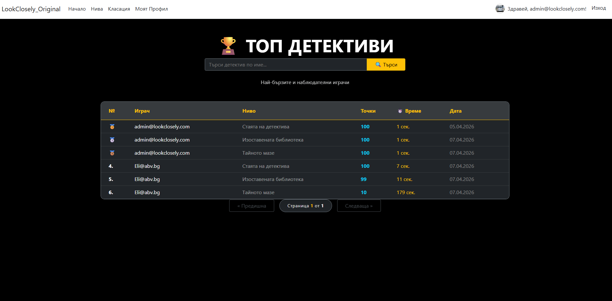

# 🔍 Look Closely - ASP.NET Core Project

## 📖 Project Overview
**"Look Closely"** is a web-based hidden object game developed as a project for the ASP.NET Fundamentals course at SoftUni. The application allows users to explore various levels, find hidden objects, and compete for the highest scores.

---

## 🚀 Key Features
* **Advanced Leaderboard:** Real-time global ranking system with search and pagination.
* **Level Management:** Full CRUD operations for game levels and hidden object assets.
* **Identity & Security:** Role-based access control (Admin/User) using ASP.NET Core Identity.
* **Custom Error Handling:** Specialized views for 404 and 500 errors.
* **Automatic Data Seeding:** DbSeeder for roles, admin user, and initial game content.

---

## 🛠 Technologies
* **Framework:** ASP.NET Core 8.0 (MVC)
* **Database:** MS SQL Server with Entity Framework Core
* **Auth:** ASP.NET Core Identity
* **UI:** Bootstrap 5 (Responsive Design)
* **Testing:** NUnit & Moq

---

## 🏗 Architecture & Design Decisions
The application follows **Clean Architecture** principles to ensure loose coupling and high maintainability:

1.  **Web Layer:** MVC with dedicated **Areas** (e.g., Administration).
2.  **Services Layer (Core):** Contains the business logic, isolated for better testability.
3.  **Repository Layer:** Implements the **Repository Pattern** to abstract data access.
4.  **Data Layer:** Manages EF Core context and migrations.
5.  **DI & OOP:** Full use of Dependency Injection and core OOP principles.

---

## 🧪 Unit Testing & Quality Assurance
Business logic reliability is guaranteed through extensive testing:
* **Coverage:** Achieved over **65% code coverage** for the service layer.
* **Testing Suite:** Built using **NUnit** and **Moq** to test edge cases like `EntityNotFoundException`.
* **Validation:** Dual-layer validation (jQuery client-side & Data Annotations server-side).

---

## 📸 Screenshots

### Home Page


### Levels Page


### Leaderboard


---

## ⚙️ Setup and Installation

1. **Clone the repository:**
   ```bash
   git clone [https://github.com/hi6tnikyt/LookClosely_Original_2026](https://github.com/hi6tnikyt/LookClosely_Original_2026)
