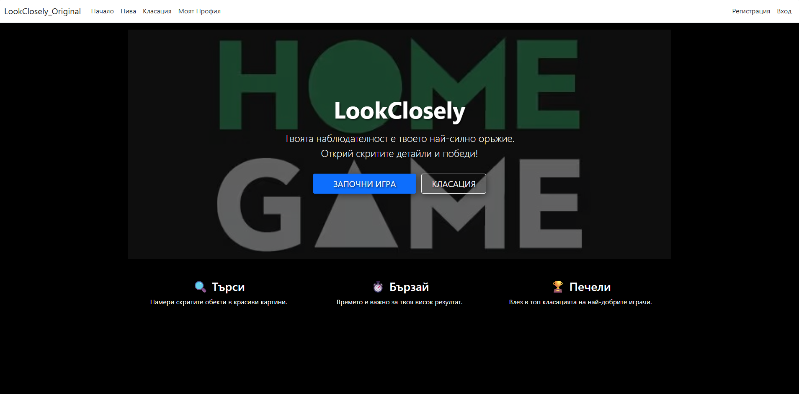
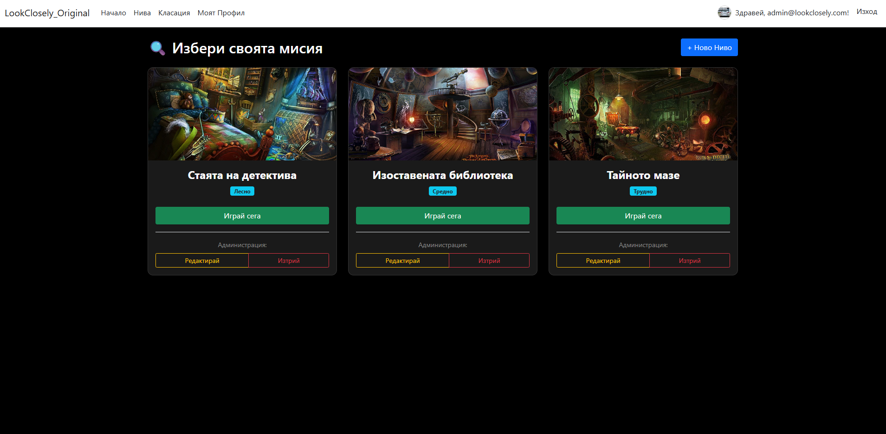

Look Closely - ASP.NET Core Project

   Project Overview

"Look Closely" is a web-based hidden object game developed as a project for the ASP.NET Fundamentals course at SoftUni. The application allows users to explore various levels, find hidden objects, and compete for the highest scores.

 --  Key Features

•	Level Management: Full CRUD operations (Create, Read, Update, Delete) for game levels.
•	Leaderboard: A global ranking system displaying the top 10 players based on their performance.
•	User Profiles: Personalized profile pages featuring user bios and score history.
•	Security & Roles: Role-based access control, ensuring administrative functions are restricted to "Admin" users.

 --  Technologies
•	ASP.NET Core 8.0 (MVC Architecture)
•	Entity Framework Core
•	MS SQL Server
•	ASP.NET Core Identity (Authentication & Authorization)
•	Bootstrap 5 (Responsive UI Design)

--   Setup and Installation

1.	Clone the repository:
Bash
git clone https://github.com/hi6tnikyt/LookClosely_Original_2026
Database Configuration:
	Update appsettings.json or use User Secrets to provide your connection string:
	 
 --   JSON

"ConnectionStrings": {
  "DefaultConnection": "Server=YOUR_SERVER;Database=LookCloselyOriginal;Trusted_Connection=True;MultipleActiveResultSets=true"
}

2.	Apply Migrations: Run the following command in the Package Manager Console:
PowerShell
Update-Database
Or using .NET CLI:
Bash
dotnet ef database update
3.	Run the Project:
	Press F5 in Visual Studio or run dotnet run in the terminal.
	 
4. Architecture & Design Decisions
The application is built with a focus on Clean Architecture, ensuring strong cohesion and loose coupling:

Multilayered Structure:

Web Layer: ASP.NET Core MVC with dedicated Areas (e.g., Administration) to separate user and admin concerns.

Services Layer (Core): Contains the business logic, fully isolated from the controllers for better testability.

Repository Layer: Implements the Repository Pattern to abstract the data access logic from the business services.

Data Layer: Manages the Entity Framework Core context, migrations, and model configurations.

Dependency Injection (DI): Utilizes the built-in ASP.NET Core DI container for all services and repositories.

OOP Principles: Proper use of encapsulation, inheritance, and abstraction throughout the codebase.	 
	
	Key Features
	
Advanced Leaderboard: Features a real-time global ranking system with implemented Search and Pagination functionalities for optimized data display.

Identity & Security: Uses the standard ASP.NET Identity system for managing Users and Roles (User/Administrator).

Level Management: Full CRUD operations for game levels, including image asset management for hidden objects.

Custom Error Handling: Includes specialized views for 404 Not Found and 500 Internal Server Error to ensure a smooth user experience.

Automatic Data Seeding: A robust DbSeeder ensures the database is pre-populated with essential roles, an admin user, and initial game levels upon startup.

     Unit Testing & Quality Assurance

	 Business logic reliability is guaranteed through extensive testing:

Coverage: Achieved over 65% code coverage for the service layer logic.

Testing Suite: Built using NUnit and Moq to simulate repository dependencies and test edge cases (e.g., EntityNotFoundException).

Validation: Both client-side (jQuery Validation) and server-side (Data Annotations) validations are implemented to prevent invalid data entry.

  ## 📸 Скрийншоти

### Home Page

### Levels Page

### Leaderboard

--   Author
[Dimitar]

